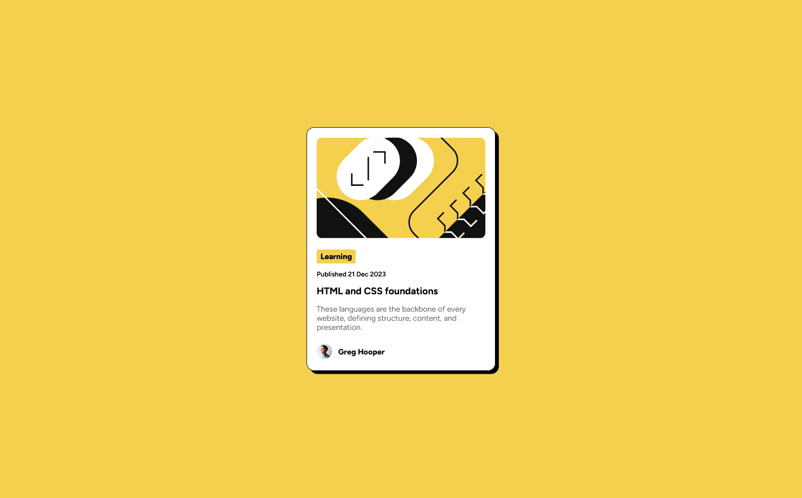

# Frontend Mentor - Blog preview card solution

This is a solution to the [Blog preview card challenge on Frontend Mentor](https://www.frontendmentor.io/challenges/blog-preview-card-ckPaj01IcS). Frontend Mentor challenges help you improve your coding skills by building realistic projects. 

## Table of contents

- [Overview](#overview)
  - [The challenge](#the-challenge)
  - [Screenshot](#screenshot)
  - [Links](#links)
- [My process](#my-process)
  - [Built with](#built-with)
  - [What I learned](#what-i-learned)
  - [Continued development](#continued-development)
  - [Useful resources](#useful-resources)
- [Author](#author)
- [Acknowledgments](#acknowledgments)

**Note: Delete this note and update the table of contents based on what sections you keep.**

## Overview

### The challenge

Users should be able to:

- See hover and focus states for all interactive elements on the page

### Screenshot

### Links

- Solution URL: [https://github.com/bt-ale/blog-preview-card](https://github.com/bt-ale/blog-preview-card)
- Live Site URL: [Add live site URL here](https://your-live-site-url.com)

## My process

### Built with

- Plain HTML and CSS
- VSCode

### What I learned

A pretty straightforward challenge.

### Continued development

These kinds of designs demand some decisions from you like choosing the right font sizes and that is something i need to learn in the future.

## Author
- Frontend Mentor - [@bt-ale](https://www.frontendmentor.io/profile/bt-ale)

